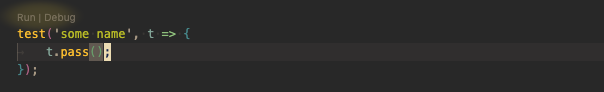

# vsc-ava-test-runner

Visual Studio Code [AVA](https://github.com/avajs/ava) test runner. This extension helps to run a single test file/test case right from the code.

## Features

Run test file via VS Code command or test case via Code Lens

## Requirements

---

## Extension Settings

This extension contributes the following settings:

* `ava-runner.experimentalEnabled` [ boolean ]: enable all [experimental features](#experimental-features). Those features might be unstable or could be removed from the extension in the feature.

## Experimental Features

* CodeLens: run test case by [line number](https://github.com/avajs/ava/blob/main/docs/05-command-line.md#running-tests-at-specific-line-numbers). Please note that some TS projects might not be able to run test case with this code lens. However, this option is more accurate and it is free from the glob pattern issue related with `--match` AVA options. AVA [`4.3.1`](https://github.com/avajs/ava/releases/tag/v4.3.1) made some improvements in this topic.

## Known Issues
Single tests are run via the [`--match` option](https://github.com/avajs/ava/blob/main/docs/05-command-line.md#running-tests-with-matching-titles). Be aware that some characters in the test case name have a special meaning.

## Laetest Release Notes

### [0.0.2] (05.07.2022)
#### Added
- Add extension setting: `ava-runner.experimentalEnabled`
- Add experimental feature: run test case via [line number](https://github.com/avajs/ava/blob/main/docs/05-command-line.md#running-tests-at-specific-line-numbers). Use the `ava-runner.experimentalEnabled` config option to enable that feature

